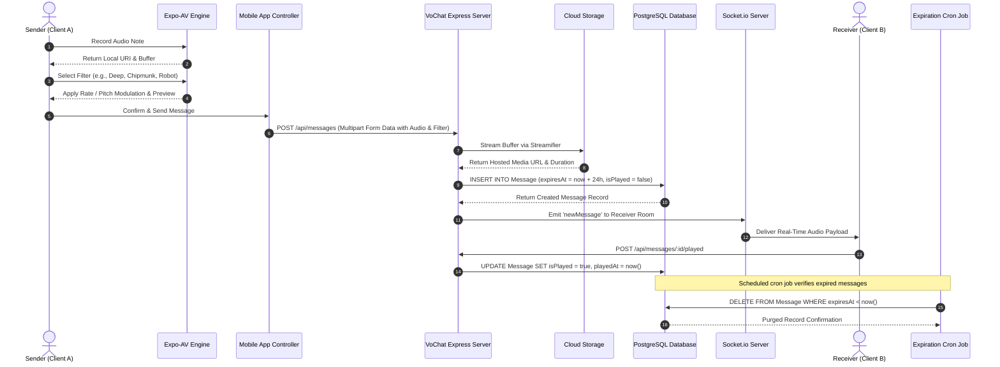
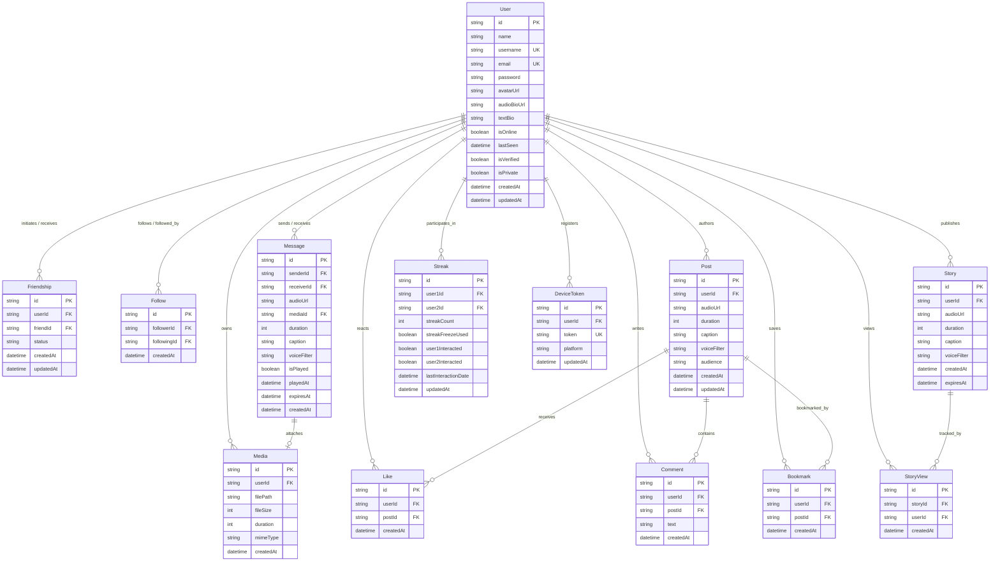

# VoChat

VoChat is an enterprise-grade, voice-first ephemeral social and real-time messaging platform. It allows users to communicate through expiring voice notes, 24-hour audio stories, and an interactive audio social feed, featuring real-time audio pitch and rate modulation filters, streak tracking, and WebSocket-driven live presence.

---

## Table of Contents

1. [System Architecture](#system-architecture)
2. [UML Sequence Diagram](#uml-sequence-diagram)
3. [Database Architecture and ER Model](#database-architecture-and-er-model)
4. [Core Features](#core-features)
5. [Voice Processing Engine](#voice-processing-engine)
6. [Technology Stack](#technology-stack)
7. [Directory Structure](#directory-structure)
8. [API Reference](#api-reference)
9. [WebSocket Event System](#websocket-event-system)
10. [Installation and Setup](#installation-and-setup)
11. [Security and Privacy](#security-and-privacy)
12. [License](#license)

---

## System Architecture

The following UML component and deployment diagram illustrates the system architecture of the VoChat ecosystem, representing the interaction between the cross-platform mobile client, backend application layers, real-time socket gateways, persistent storage, and third-party cloud services.

```mermaid
graph TD
    %% Custom Vibrant Color Classes
    classDef clientStyle fill:#1e40af,stroke:#60a5fa,stroke-width:2px,color:#ffffff;
    classDef gatewayStyle fill:#5b21b6,stroke:#a78bfa,stroke-width:2px,color:#ffffff;
    classDef serviceStyle fill:#065f46,stroke:#34d399,stroke-width:2px,color:#ffffff;
    classDef realtimeStyle fill:#9a3412,stroke:#fb923c,stroke-width:2px,color:#ffffff;
    classDef dbStyle fill:#831843,stroke:#f472b6,stroke-width:2px,color:#ffffff;
    classDef workerStyle fill:#374151,stroke:#9ca3af,stroke-width:2px,color:#ffffff;
    classDef cloudStyle fill:#075985,stroke:#38bdf8,stroke-width:2px,color:#ffffff;

    subgraph Client_Layer ["Mobile Client Layer (React Native / Expo SDK 54)"]
        UI["UI & Presentation Engine\n(Expo Router, Reanimated, Screens)"]:::clientStyle
        AudioEngine["Audio Subsystem\n(Expo-AV Recording, Rate/Pitch Modulation)"]:::clientStyle
        SocketClient["Socket.io Client\n(Real-Time Messaging & Status)"]:::clientStyle
        ApiClient["HTTP / REST Client\n(Axios Interceptor, SecureStore Token)"]:::clientStyle
    end

    subgraph Gateway_Layer ["API Gateway & Security Layer (Express 5)"]
        Router["Express Router & Route Handlers"]:::gatewayStyle
        AuthMiddleware["Authentication & JWT Guard"]:::gatewayStyle
        RateLimiter["Rate Limiting & Security\n(Helmet, Express Rate Limit)"]:::gatewayStyle
        ValidationMiddleware["Input Validation Layer\n(Zod Schemas)"]:::gatewayStyle
        UploadMiddleware["Media Upload Handler\n(Multer & Streamifier)"]:::gatewayStyle
    end

    subgraph Service_Layer ["Backend Domain Modules"]
        AuthModule["Auth Module\n(OTP, Verification, Passwords)"]:::serviceStyle
        UserModule["User & Profile Module\n(Audio Bios, Privacy Settings)"]:::serviceStyle
        MessageModule["Ephemeral Messaging Module\n(24h Auto-Expiry Engine)"]:::serviceStyle
        StoryModule["Stories Module\n(24h Window, View Tracking)"]:::serviceStyle
        PostModule["Audio Posts Module\n(Likes, Comments, Bookmarks)"]:::serviceStyle
        StreakModule["Streak Engine\n(Daily Activity, Freeze Logic)"]:::serviceStyle
        NotificationModule["Push Notification Engine\n(FCM Dispatcher)"]:::serviceStyle
    end

    subgraph RealTime_Layer ["Real-Time Socket Gateway"]
        SocketServer["Socket.io Server Engine"]:::realtimeStyle
        PresenceManager["Presence & Live Connection Tracker"]:::realtimeStyle
        RoomManager["Direct Messaging & Channel Rooms"]:::realtimeStyle
    end

    subgraph Background_Workers ["Background Job Engine"]
        CronCleanup["Node-Cron Expiry Service\n(Ephemeral Message & Story Purge)"]:::workerStyle
    end

    subgraph Persistence_Layer ["Data & Cloud Storage Services"]
        PrismaORM["Prisma ORM Layer (Prisma Client v7)"]:::dbStyle
        PostgresDB[("PostgreSQL Relational Database")]:::dbStyle
        CloudMedia[("Cloudinary Media Storage\n(Audio Files & Assets)")]:::cloudStyle
        FCM["Firebase Cloud Messaging\n(Push Notification Service)"]:::cloudStyle
    end

    %% Subgraph Container Styling
    style Client_Layer fill:#0f172a,stroke:#3b82f6,stroke-width:2px,color:#93c5fd
    style Gateway_Layer fill:#1e1b4b,stroke:#8b5cf6,stroke-width:2px,color:#c4b5fd
    style Service_Layer fill:#062e24,stroke:#10b981,stroke-width:2px,color:#6ee7b7
    style RealTime_Layer fill:#431407,stroke:#f97316,stroke-width:2px,color:#fdba74
    style Persistence_Layer fill:#500724,stroke:#ec4899,stroke-width:2px,color:#f472b6
    style Background_Workers fill:#1f2937,stroke:#9ca3af,stroke-width:2px,color:#e5e7eb

    %% Data Flow Connections
    UI --> AudioEngine
    UI --> ApiClient
    UI --> SocketClient
    ApiClient --> RateLimiter
    RateLimiter --> AuthMiddleware
    AuthMiddleware --> ValidationMiddleware
    ValidationMiddleware --> Router

    SocketClient <--> SocketServer
    SocketServer --> PresenceManager
    SocketServer --> RoomManager

    Router --> AuthModule
    Router --> UserModule
    Router --> MessageModule
    Router --> StoryModule
    Router --> PostModule
    Router --> StreakModule
    Router --> NotificationModule
    UploadMiddleware --> CloudMedia

    AuthModule --> PrismaORM
    UserModule --> PrismaORM
    MessageModule --> PrismaORM
    StoryModule --> PrismaORM
    PostModule --> PrismaORM
    StreakModule --> PrismaORM
    NotificationModule --> FCM
    PrismaORM --> PostgresDB

    CronCleanup --> PrismaORM
```



---

## UML Sequence Diagram

This sequence diagram depicts the end-to-end lifecycle of an ephemeral voice message: recording, applying voice modulation, multipart upload to the media storage, persistence via Prisma, real-time dispatch over WebSockets, recipient consumption, and automated ephemeral purging.



---

## Database Architecture and ER Model

The data layer is managed via PostgreSQL with Prisma ORM. Below is the complete Entity-Relationship diagram illustrating relational cardinalities and domain boundaries.



---

## Core Features

### 1. Ephemeral Voice Messaging
- Direct peer-to-peer audio messaging with enforced lifespans.
- Messages auto-expire after a configured duration (default: 24 hours) or immediately after playback based on channel configuration.
- Read and playback receipts with timestamp metadata.

### 2. Real-Time Voice Modulation & Audio Filters
- On-the-fly audio modification using hardware-accelerated playback rate and pitch shift algorithms (`Expo-AV`).
- Filters include Normal, Deep Voice, Chipmunk, Robot, Fast Echo, and Low Bass.
- Preview modulation locally before confirming transmission.

### 3. 24-Hour Voice Stories
- Ephemeral audio status updates visible to connections for 24 hours.
- Live progress waveform rendering during playback.
- Story view tracking with viewer lists and timestamp metrics.

### 4. Audio Social Feed
- Public and friend-exclusive voice posts.
- Interactive engagement: likes, voice and text comments, bookmarks, and shareable audio links.
- Audience visibility toggles (`ALL` for public feeds, `FRIENDS` for private networks).

### 5. Interaction Streaks & Freeze Logic
- Tracks daily consecutive voice interactions between friends.
- Automatic streak calculation and status updating.
- Streak Freeze recovery mechanism to prevent broken progress.

### 6. User Profiles & Audio Bio
- Audio-first profile customization allowing users to record an audio bio snippet alongside standard avatar and text metadata.
- Private account controls restricting direct messaging and story views to mutual friendships.

### 7. Real-Time Presence & Socket Gateway
- Instant online and offline status detection.
- Live typing and recording indicators.
- Instantaneous delivery of incoming audio notifications and messages.

---

## Voice Processing Engine

VoChat employs an audio processing pipeline implemented across the mobile client and backend storage layers:

| Filter Name | Playback Rate (`setRateAsync`) | Pitch Correction Parameter | Acoustic Characteristics |
| :--- | :--- | :--- | :--- |
| **Normal** | `1.0x` | `true` | Original voice tone and duration |
| **Deep** | `0.75x` | `false` | Lower fundamental frequency, authoritative resonance |
| **Chipmunk** | `1.4x` | `false` | Higher fundamental frequency, fast tempo |
| **Robot** | `0.9x` | `false` | Metallic tonal profile |
| **Fast Forward**| `1.5x` | `true` | Preserved pitch with accelerated playback duration |
| **Slow Motion** | `0.65x` | `true` | Preserved pitch with decelerated tempo |

---

## Technology Stack

### Mobile Application (`vochat-android`)
- **Core Framework**: React Native (0.81.5), Expo SDK 54
- **Routing Engine**: Expo Router (v6) with file-based navigation
- **Language**: TypeScript (v5.9)
- **Audio Management**: Expo-AV (`Audio.Recording`, `Audio.Sound`)
- **Animation Suite**: React Native Reanimated (v4), React Native Worklets
- **State & Storage**: React Hooks, AsyncStorage, Expo SecureStore
- **Real-Time Client**: Socket.io-client (v4.8)
- **Network Layer**: Axios with centralized request/response interceptors

### Backend API Server (`vochat-backend`)
- **Runtime & Framework**: Node.js, Express (v5.2)
- **Database Access**: Prisma ORM (v7.8) with PostgreSQL Driver Adapter
- **Database Engine**: PostgreSQL
- **Real-Time Gateway**: Socket.io (v4.8)
- **Authentication**: JSON Web Tokens (JWT), bcryptjs password hashing
- **Data Validation**: Zod schema validation
- **File & Media Handling**: Multer, Cloudinary SDK, Streamifier
- **Push Notifications**: Firebase Admin SDK (Cloud Messaging)
- **Scheduled Workers**: Node-Cron (v4.2)
- **Security & Logging**: Helmet, CORS, Express-Rate-Limit, Winston, Morgan

---

## Directory Structure

```text
vochat/
├── vochat-android/                  # React Native / Expo Mobile Application
│   ├── app/                         # Expo Router screens and routes
│   │   ├── (tabs)/                  # Bottom tab navigation screens
│   │   │   ├── index.tsx            # Main social audio feed
│   │   │   ├── audio.tsx            # Voice explorer & trending clips
│   │   │   ├── friends.tsx          # Connections & direct messages
│   │   │   └── profile.tsx          # User profile & audio bio
│   │   ├── chat/                    # Direct messaging conversation routes
│   │   ├── record.tsx               # Voice recording modal & waveform
│   │   ├── voice-preview.tsx        # Filter selection & preview player
│   │   ├── streaks.tsx              # Streak overview & metrics
│   │   ├── edit-profile.tsx         # Profile edit & audio bio recording
│   │   ├── login.tsx                # Authentication login screen
│   │   ├── register.tsx             # User registration screen
│   │   ├── api.ts                   # Centralized Axios client & interceptors
│   │   └── socket.ts                # Socket.io connection manager
│   ├── components/                  # Reusable UI component library
│   │   ├── StoriesBar.tsx           # Horizontal stories rail
│   │   ├── StoryViewerModal.tsx     # Fullscreen story player with badge
│   │   └── Toast.tsx                # Notification toast provider
│   ├── constants/                   # Design tokens, themes, color palettes
│   └── package.json                 # Mobile dependencies and scripts
│
├── vochat-backend/                  # Node.js / Express REST & Socket API
│   ├── prisma/                      # Database configuration
│   │   ├── schema.prisma            # Relational database schema
│   │   └── seed.js                  # Database seed fixtures
│   ├── src/
│   │   ├── app.js                   # Application entry point & server bootstrap
│   │   ├── config/                  # Environment, Prisma client, Cloudinary configs
│   │   ├── middleware/              # Auth guard, error handlers, rate limiters
│   │   ├── modules/                 # Modular domain services
│   │   │   ├── auth/                # Login, registration, token issuance
│   │   │   ├── user/                # User management & bio updates
│   │   │   ├── message/             # Ephemeral message management
│   │   │   ├── stories/             # 24h story creation & view logs
│   │   │   ├── posts/               # Audio posts, likes, comments, bookmarks
│   │   │   ├── friend/              # Friend requests & status updates
│   │   │   ├── streak/              # Streak calculation & freeze logic
│   │   │   ├── media/               # Audio upload & asset streaming
│   │   │   └── notification/        # Device token registry & FCM dispatcher
│   │   ├── socket/                  # WebSocket gateway handlers and rooms
│   │   └── utils/                   # Shared logging, formatters, validation
│   └── package.json                 # Backend dependencies and scripts
│
├── .gitignore                       # Global git ignore configuration
└── README.md                        # Master project documentation
```

---

## API Reference

### Authentication Endpoints
- `POST /api/auth/register` - Create a new user account.
- `POST /api/auth/login` - Authenticate credentials and receive a JWT.
- `POST /api/auth/verify-otp` - Verify email OTP token.
- `POST /api/auth/resend-otp` - Request a refreshed verification code.

### Ephemeral Messages
- `POST /api/messages` - Send a voice message with multipart audio attachment.
- `GET /api/messages/:userId` - Fetch active messages for a specific conversation.
- `POST /api/messages/:id/played` - Mark message as played to trigger ephemerality rules.
- `DELETE /api/messages/:id` - Revoke or delete a message.

### Stories
- `POST /api/stories/create` - Upload and publish a 24-hour audio story.
- `GET /api/stories/feed` - Retrieve active stories from followed users.
- `POST /api/stories/:id/view` - Register a story view for the authenticated user.
- `DELETE /api/stories/:id` - Delete an active story before the 24-hour expiration.

### Audio Posts & Social Feed
- `POST /api/posts` - Create a new audio feed post.
- `GET /api/posts/feed` - Fetch public and friends audio posts with pagination.
- `POST /api/posts/:id/like` - Toggle like status on an audio post.
- `POST /api/posts/:id/comment` - Add a comment to an audio post.
- `POST /api/posts/:id/bookmark` - Save an audio post to bookmarks.

### Streaks & Friends
- `GET /api/streaks` - Retrieve active streaks across all active connections.
- `POST /api/streaks/freeze` - Activate a streak freeze for an ongoing streak.
- `POST /api/friends/request` - Send a friendship invitation.
- `PUT /api/friends/respond` - Accept or decline an incoming friend request.

---

## WebSocket Event System

The real-time service runs over Socket.io and facilitates instant interaction dispatching:

### Inbound Events (Client to Server)
- `joinRoom` - Join a private one-to-one conversation room (`payload: { roomId }`).
- `leaveRoom` - Leave a conversation room (`payload: { roomId }`).
- `typingStart` - Broadcast recording or typing activity (`payload: { receiverId }`).
- `typingStop` - Clear recording or typing activity (`payload: { receiverId }`).

### Outbound Events (Server to Client)
- `newMessage` - Dispatched when a new audio message is processed.
- `messagePlayed` - Notifies the sender when their voice note has been listened to.
- `userStatusChange` - Broadcasts live online/offline presence changes.
- `streakUpdated` - Notifies users when a streak counter advances.

---

## Installation and Setup

### Prerequisites
- Node.js (v18.0.0 or higher)
- PostgreSQL (v14.0 or higher)
- npm or yarn package manager
- Expo Go CLI or Android Studio (for Android emulator testing)

### 1. Clone the Repository
```bash
git clone https://github.com/AviralNITW/Vochat.git
cd Vochat
```

### 2. Backend Setup
```bash
cd vochat-backend

# Install dependencies
npm install

# Setup environment variables from template
cp .env.example .env

# Run database migrations and generate Prisma Client
npx prisma generate
npx prisma db push

# Optional: Seed the database
npm run db:seed

# Start the development server
npm run dev
```
The backend service will be active at `http://localhost:5000`.

### 3. Mobile Client Setup
```bash
cd ../vochat-android

# Install dependencies
npm install

# Start the Expo development server
npx expo start
```
Use the Expo Go application or launch an Android emulator (`a` key in terminal) to run the application.

---

## Security and Privacy

- **Encrypted Password Storage**: User credentials hashed using bcrypt with salt rounds.
- **Stateless Authentication**: Protected API endpoints guarded by JWT bearer tokens.
- **Privacy Partitioning**: Private profile flag isolates stories, posts, and messaging access strictly to approved friends.
- **Ephemeral Auto-Deletion**: Automated backend cron worker regularly purges expired audio files and database records to prevent unneeded data retention.
- **Input Sanitization**: Request bodies sanitized and validated strictly via Zod schemas before hitting business layers.

---

## License

This project is licensed under the ISC License. Refer to the LICENSE file for details.
